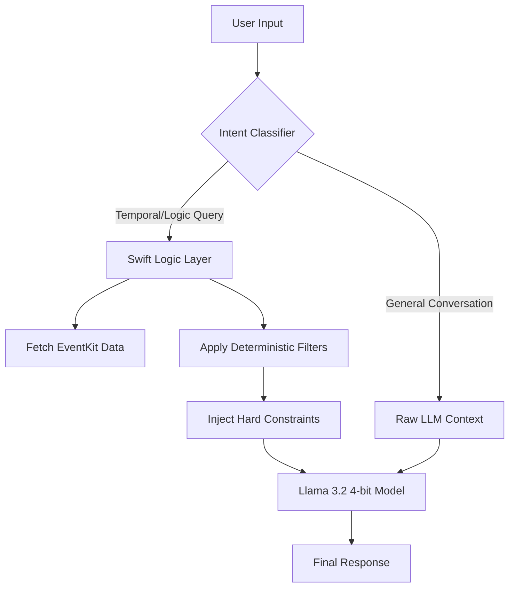

# DailyMind: Neuro-Symbolic AI on iOS

**An experimental on-device agent that bridges the gap between Small Language Models (SLMs) and reliable mobile assistance.**

DailyMind (formerly *Local Intelligence*) demonstrates how 1B-parameter models can be engineered to perform complex reasoning tasks on Apple Silicon without cloud dependencies. It implements a **Hybrid Neuro-Symbolic Architecture** using Swift and Apple’s MLX framework.

  <table>
    <tr>
      <td align="center">
        
         
        <em>Zero-Trust Interface</em>
      </td>
      <td align="center">
        
         
        <em>Hybrid Inference Engine in Action</em>
      </td>
    </tr>
  </table>

---

## The Engineering Challenge

Deploying Large Language Models on mobile devices faces a trilemma: **Latency, Privacy, and Accuracy.** While quantized 1B models (like Llama 3.2) are fast enough for iPhones, they suffer from the **"Reasoning Gap."** They are excellent at natural language generation but prone to hallucinations when handling strict logic, temporal data (e.g., "next Tuesday"), or structured retrieval tasks.

**DailyMind solves this by decoupling "Reasoning" from "Language."**

## Architecture: The Hybrid Engine

Instead of relying solely on the probabilistic nature of the LLM, DailyMind employs a deterministic **Pre-Computed Response (PCR)** layer. 

The system intercepts user intent via Swift native logic *before* the LLM inference begins. If a deterministic fact is required (e.g., checking the calendar), the app computes the truth, injects it into the system prompt, and treats the LLM purely as a natural language interface layer.

### Key Technical Implementations

1.  **Logic Offloading:** Temporal queries (e.g., *"What am I doing tomorrow?"*) are resolved by iOS `EventKit` and filtered via Swift algorithms (O(1) complexity), completely bypassing the LLM's weak reasoning circuits.

2.  **System Injection Strategy:**
    The calculated "Ground Truth" is injected into the context window with strict formatting instructions. This effectively eliminates hallucinations regarding user schedules.

3.  **Memory Optimization:**
    Utilizes 4-bit quantization to maintain a memory footprint under 2GB, preventing iOS memory pressure terminations (OOM) while leaving headroom for the OS.

---

## R&D Evolution

This architecture was not the starting point but the result of iterative failure analysis:

* **Iteration 1 (Phi-3 Mini):** Initial tests with Microsoft's Phi-3 (3.8B) showed strong reasoning but unacceptable latency (3-4 tokens/sec) and thermal throttling on the iPhone 15 Pro.
* **Iteration 2 (Llama 3.2 1B - Raw):** Switching to a smaller model solved the speed issue but introduced significant hallucinations. The model struggled to differentiate between "This Week" and "Next Week."
* **Final State (Hybrid):** The Neuro-Symbolic approach was adopted. By treating the LLM as a "UI component" rather than a "Brain," the system achieved 100% factual accuracy on calendar tasks while maintaining conversational fluidity.

## Tech Stack

* **Language:** Swift 5.9 (SwiftUI)
* **Inference:** Apple MLX (Machine Learning Exchange)
* **Model:** `mlx-community/Llama-3.2-1B-Instruct-4bit`
* **Data Source:** Local iOS Calendar (EventKit)
* **Architecture:** MVVM + Neuro-Symbolic RAG

## Privacy & Security

DailyMind operates on a strict **Local-Only** policy:
* **No Cloud:** Weights are stored on-device. No API calls to OpenAI or Anthropic.
* **Ephemeral Data:** Calendar data is processed in RAM only for the duration of the inference session and is never written to persistent storage.

## Installation & Setup

1.  Clone the repository.
2.  Open `ios-app/DailyMind.xcodeproj` in Xcode 15+.
3.  Set the Signing Team to your Apple Developer account.
4.  **Important:** Deploy to a physical device (iPhone 15 Pro or newer recommended). The MLX Metal backend requires physical GPU hardware; it will not run on the Simulator.

---

