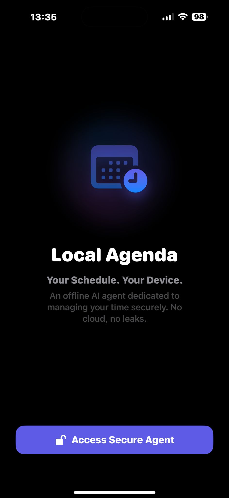
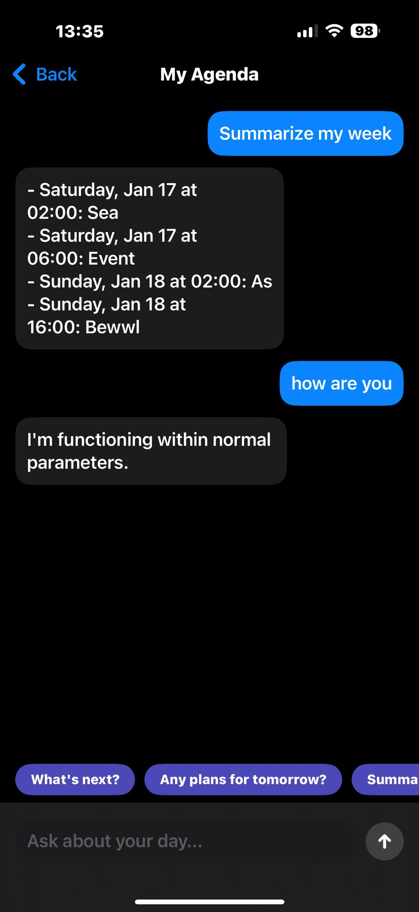

# DailyMind: Privacy-First On-Device AI Agenda

DailyMind is an experimental iOS application designed to explore the capabilities and limitations of Small Language Models (SLMs) running locally on Apple Silicon. It utilizes the **Apple MLX** framework to run a quantized **Llama 3.2 1B** model, creating a retrieval-augmented generation (RAG) system that interacts with the user's local calendar data without any cloud dependency.

## Project Overview

The primary objective of this project was to solve a specific engineering challenge: **How to make low-parameter LLMs (1B) perform reliable reasoning tasks on mobile hardware.**

While larger models (70B+) can easily handle complex temporal logic (e.g., distinguishing between "Next Event" and "Tomorrow's Schedule"), 1B-parameter models often hallucinate or fail to adhere to strict formatting instructions. DailyMind implements a **Hybrid Deterministic/Probabilistic Architecture** to overcome these limitations, ensuring 100% accuracy for scheduling tasks while retaining the conversational interface of an LLM.

## Interface & Functionality

  
   

## Technical Architecture

The application is built using Swift and SwiftUI, integrating directly with the `EventKit` framework for data retrieval and `MLX` for model inference.

### 1. The Hybrid Engine (Deterministic Pre-Processing)
A standard RAG approach involves feeding raw data to the model and asking it to summarize. During testing, I found that the Llama 3.2 1B model frequently failed to correctly filter dates or would hallucinate events when the context window was cluttered.

To solve this, I engineered a **Pre-Computed Response (PCR)** layer within the `ModelEngine` class:

* **Intent Classification:** The system uses O(1) heuristic pattern matching to identify specific user intents (e.g., `tomorrow`, `next`, `summarize`).
* **Logic Offloading:** Instead of relying on the neural network for logic, the application uses native Swift code to filter and sort the calendar data.
* **System Injection:** The calculated answer is injected into the system prompt with a strict mandate. The LLM is effectively downgraded from a "reasoning engine" to a "natural language interface," ensuring the output is factually correct but conversationally presented.

### 2. Local Data Retrieval
The `LocalDataManager` handles the extraction of calendar events. It normalizes the data into a token-efficient format, stripping unnecessary metadata to maximize the limited context window available on mobile devices. This module also handles iOS 17+ privacy permissions, ensuring the user grants explicit access before any data is fetched.

### 3. Model Quantization
The project utilizes 4-bit quantization to fit the model within the RAM constraints of standard iPhones. This allows the application to load the model logic and the inference engine in under 2GB of memory, preventing operating system terminations due to memory pressure.

## Research & Development Journey

This project evolved through several iterations of failure and optimization:

**Initial Experiments with Phi-3:**
Development began using Microsoft's Phi-3 Mini (3.8B). While the reasoning capabilities were stronger, the memory footprint and thermal impact on the test device (iPhone 15 Pro) were deemed too high for a practical utility app. The inference latency was approximately 3-4 seconds per token, which degraded the user experience.

**Transition to Llama 3.2:**
I pivoted to Meta's Llama 3.2 1B architecture for its speed. However, this introduced the "Reasoning Gap." The 1B model struggled to understand the concept of "Next Week" versus "This Week." It would often output the entire dataset instead of filtering it.

**The "Hallucination" Problem:**
In early builds, when asked "What is my next event?", the model would sometimes invent plausible-sounding meetings based on the few-shot examples provided in the prompt, ignoring the actual retrieved context.

**The Hybrid Solution:**
These failures led to the decision to stop fighting the model's limitations and instead support it with deterministic code. By moving the logic layer to Swift (as seen in `ModelEngine.swift`), the system achieved the reliability of a traditional app with the flexibility of a chat interface.

## Technology Stack

* **Language:** Swift 5.9
* **UI Framework:** SwiftUI
* **Inference Engine:** Apple MLX (Machine Learning Exchange)
* **Model:** Llama-3.2-1B-Instruct-4bit
* **Data Source:** EventKit (Local Calendar)

## Privacy & Security

This application is designed with a "Zero-Trust" architecture regarding cloud services.
* **Offline Inference:** The model weights are stored locally. No API calls are made to OpenAI, Anthropic, or any other provider.
* **Data Sovereignty:** Calendar data is processed in ephemeral memory and is never written to persistent storage by the app, nor transmitted off the device.

## Installation

1.  Clone the repository.
2.  Open `DailyMind.xcodeproj` in Xcode 15+.
3.  Ensure the Signing Team is set to your Apple Developer account.
4.  Deploy to a physical iOS device (Required for MLX Metal acceleration).
    * *Note: The simulator does not support the GPU instructions required for the model engine.*

## License

MIT License
